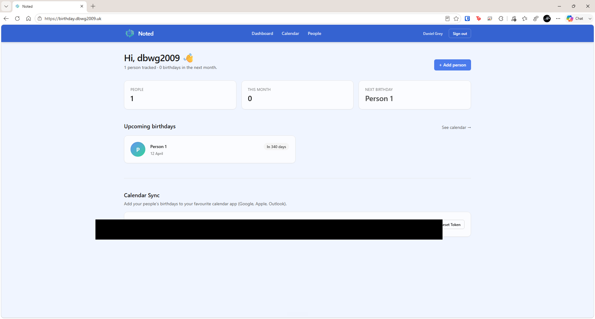
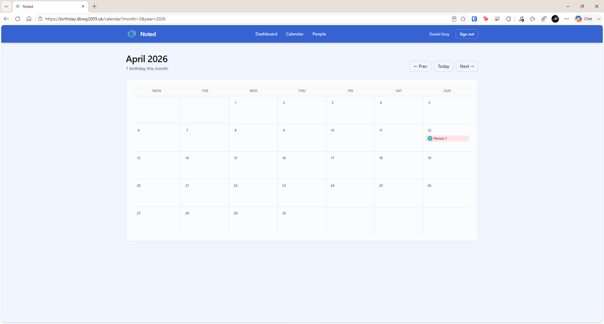
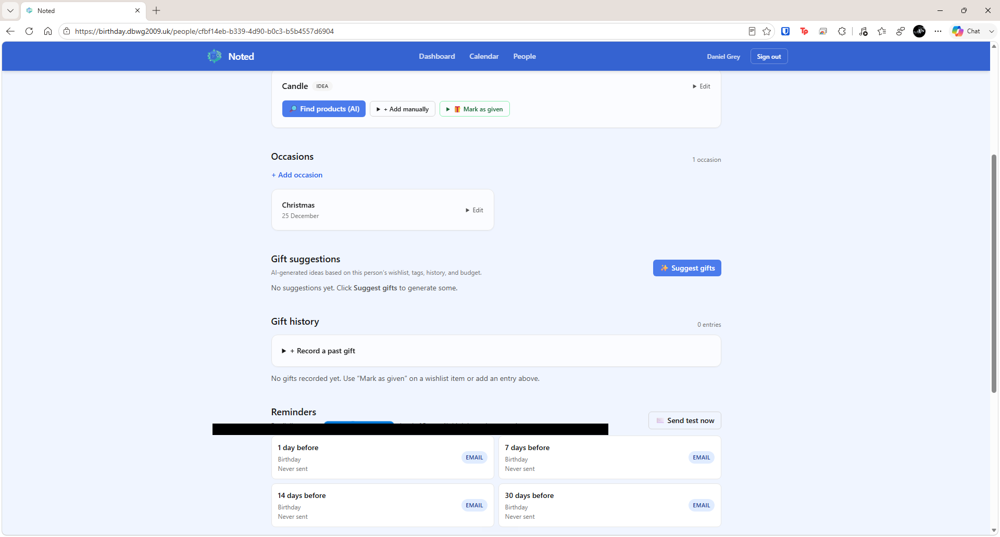

<p align="center">
  
</p>

<p align="center">
  <a href="https://github.com/dbwg2009/Noted/releases/latest"></a>
  
  
  
</p>

<p align="center">
  A self-hosted, AI-powered gift planner and birthday tracker.<br/>
  Never forget a birthday. Always give the perfect gift.
</p>

---

## Screenshots

| Dashboard | Calendar | Person detail |
|:---------:|:--------:|:-------------:|
|  |  |  |

---

## Features

- **Birthdays & Occasions** — Track birthdays, anniversaries, Christmas, Mother's/Father's Day, and custom occasions, each with a countdown badge.
- **Wishlists** — Manage gift ideas per person with a full status workflow: idea → research → chosen → given.
- **AI Product Lookup** — Finds UK products within budget using OpenRouter AI, with an eBay fallback for guaranteed-real listings and prices.
- **AI Gift Suggestions** — Thoughtful ideas generated from each person's interests, gift history, and budget.
- **Email Reminders** — Automatic digest emails via Resend at 30, 14, 7, and 1 day before each occasion.
- **Shareable Wishlists** — Generate a read-only public link so family can see what someone wants (optional expiry).
- **Gift History** — Log what you gave and when; reactions feed back into future AI suggestions.
- **Calendar Sync** — iCal feed compatible with Google Calendar, Apple Calendar, and Outlook.
- **Photo Uploads** — Attach a photo to each person; stored on a Docker volume or as base64 for serverless deployments.

---

## Quick Start

The fastest way to run Noted is with Docker — no build step required. Images are pulled from Docker Hub automatically.

### 1. Download the config files

**curl:**
```bash
curl -O https://raw.githubusercontent.com/dbwg2009/Noted/main/docker-compose.yml
curl -O https://raw.githubusercontent.com/dbwg2009/Noted/main/.env.example
mv .env.example .env
```

**wget:**
```bash
wget https://raw.githubusercontent.com/dbwg2009/Noted/main/docker-compose.yml
wget -O .env https://raw.githubusercontent.com/dbwg2009/Noted/main/.env.example
```

### 2. Fill in `.env`

| Variable | Required | How to get it |
|----------|:--------:|---------------|
| `AUTH_SECRET` | ✅ | `openssl rand -base64 32` |
| `AUTH_URL` | ✅ | Your server URL, e.g. `http://192.168.1.10:3000` |
| `RESEND_API_KEY` | ✅ | [resend.com](https://resend.com) — free tier works |
| `OPENROUTER_API_KEY` | ✅ | [openrouter.ai](https://openrouter.ai) — free tier works |
| `CRON_SECRET` | ✅ | `openssl rand -hex 32` |
| `EBAY_APP_ID` | Optional | [developer.ebay.com](https://developer.ebay.com) — enables real eBay listings as a product-search fallback |
| `EMAIL_FROM` | Optional | Sender name/address (default: `Noted <onboarding@resend.dev>`) |
| `OPENROUTER_MODEL` | Optional | Override the AI model (default: `meta-llama/llama-3.3-70b-instruct:free`) |

### 3. Start

```bash
docker compose up -d
```

The `migrate` service applies the schema before the app starts. Open [http://localhost:3000](http://localhost:3000), register your account, and you're in.

---

## Self-Hosting Tips

- **Raspberry Pi / ARM** — Images are multi-arch (`linux/amd64`, `linux/arm64`). `COMPOSE_BAKE=false` in `.env.example` avoids a known Docker Engine issue on ARM.
- **Persistent uploads** — The `uploads` Docker volume keeps photos across restarts. For serverless/Vercel, set `STORAGE_STRATEGY=base64` to store photos in the database instead.
- **Reminders** — The `cron` sidecar pings the reminders endpoint every `CRON_INTERVAL_SECONDS` (default `86400` = once a day). Lower it while testing.
- **Reverse proxy** — Put Nginx or Caddy in front and set `AUTH_URL` to your public domain (e.g. `https://noted.yourdomain.com`).
- **OpenRouter rate limits** — Free models are rate-limited. If you hit a 429, switch model via `OPENROUTER_MODEL` or add a BYOK credit at [openrouter.ai/settings/integrations](https://openrouter.ai/settings/integrations). The eBay fallback kicks in automatically on rate-limit errors.

---

## Calendar Sync

Find your unique iCal URL at the bottom of the Dashboard. Paste it into:

- **Google Calendar** → Other calendars → Add by URL
- **Apple Calendar** → File → New Calendar Subscription
- **Outlook** → Add Calendar → From Internet

---

## Local Development

See [CONTRIBUTING.md](CONTRIBUTING.md) for the full setup guide. Quick start:

```bash
git clone https://github.com/dbwg2009/Noted.git && cd Noted
cp .env.example .env.local   # fill in DATABASE_URL and other vars
npm install
npm run db:push
npm run dev
```

---

## Tech Stack

| Layer | Technology |
|-------|------------|
| Framework | Next.js 15 (App Router, standalone output) |
| Language | TypeScript (strict) |
| Database | PostgreSQL via Drizzle ORM |
| Auth | Auth.js v5 (Credentials provider, JWT sessions) |
| Styles | Tailwind CSS v3 |
| AI | OpenRouter (default: `meta-llama/llama-3.3-70b-instruct:free`) |
| Product search | eBay Browse API (fallback for real listings) |
| Email | Resend |
| Deployment | Docker Compose (primary) · Vercel + Neon (alternative) |

---

## Roadmap

| Phase | What |
|-------|------|
| 8 — Group Gifts | Coordinate split purchases; track who's contributing what |
| 9 — Price-Drop Alerts | Watch a saved product; get an email when it drops below your target price |
| 10 — Browser Extension | Right-click any product page and save it directly to a wishlist |

See [docs/V2_DESIGN.md](docs/V2_DESIGN.md) for full spec and schema details.

---

## Contributing

Contributions, issues, and feature requests are welcome. Read [CONTRIBUTING.md](CONTRIBUTING.md) before opening a PR — it covers branch workflow, commit conventions, and the Docker dev setup.

## License

[MIT](LICENSE) © 2026 dbwg2009
